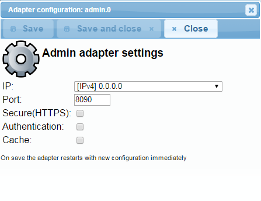

#Admin

L'adaptateur administrateur est utilisé pour configurer l'ensemble de l'installation ioBroker et tous ses adaptateurs.
Il fournit une interface Web qui peut être ouverte avec "http://<adresse IP du serveur>:8081".
dans le navigateur web. Cet adaptateur est automatiquement installé avec ioBroker.

##Configuration:

La boîte de dialogue de configuration de l'adaptateur "admin" fournit les paramètres suivants:

**IP:** L'adresse IP du serveur Web "admin" peut être choisie ici.
Différentes adresses IPv4 et IPv6 peuvent être sélectionnées. La valeur par défaut est 0.0.0.0\.
Si vous pensez que 0.0.0.0 est un paramètre invalide, laissez-le rester, car il
est absolument valide. Si vous modifiez l'adresse, vous pourrez accéder au serveur Web.
seulement par cette adresse. **Port:** Vous pouvez spécifier le port du serveur Web "admin".
S'il y a plus de serveurs Web sur le PC ou le périphérique, le port doit être personnalisé pour éviter tout problème.
d'une allocation de double port. **Codage:** activez cette option si le protocole sécurisé https doit être utilisé.

**Authentification:** Si vous souhaitez une authentification avec login / mot de passe, vous devez activer cette case à cocher.
Le mot de passe par défaut de l'utilisateur "admin" est "iobroker" **Tampon:** pour accélérer le chargement des pages, activez cette option.
Normalement, seul le développeur souhaite que cette option soit décochée.

##Manipulation:

La page principale de l'administrateur se compose de plusieurs onglets. **Adaptateur:** Voici les instances de
un adaptateurs peuvent être installés ou supprimés. Avec le bouton de mise à jour

en haut à gauche, nous pouvons voir si les nouvelles versions des adaptateurs sont disponibles.

Les versions disponibles et installées de l'adaptateur sont affichées. Pour une vue d'ensemble de l'état de la
l'adaptateur est coloré (rouge = dans la planification; orange = alpha; jaune = bêta). Les mises à jour vers une version plus récente de
les adaptateurs sont fabriqués ici aussi. S'il existe une version plus récente, le lettrage de l'onglet sera vert.
Si l'icône de point d'interrogation de la dernière colonne est active, vous pouvez accéder au site Web contenant les informations de l'adaptateur.
Les adaptateurs disponibles sont triés par ordre alphabétique. Les instances déjà installées sont dans la partie supérieure de la liste.

**Instance:** Les instances déjà installées sont répertoriées ici et peuvent être configurées en conséquence. Si le titre de la
exemple, vous pouvez cliquer dessus et le site Web correspondant s’ouvrira.

**Objects:** les objets gérés (par exemple, setup / variables / programmes du matériel connecté)

**Etats:** les états actuels (valeurs des objets)
Si l'historique de l'adaptateur est installé, vous pouvez enregistrer les points de données choisis.
Les points de données enregistrés sont sélectionnés à droite et apparaissent avec un logo vert.

**Scripts:** cet onglet n'est actif que si l'adaptateur "javascript" est installé.

**Node-red:** Cet onglet n'est visible que si l'adaptateur "node-red" est installé et activé.

**Hôtes:** l'ordinateur sur lequel ioBroker est installé. Ici, la dernière version de js-controller peut être installée.
S'il existe une nouvelle version, les lettres de l'onglet sont en vert. Pour rechercher une nouvelle version, vous devez cliquer sur la mise à jour.
icône dans le coin inférieur gauche.

**Dénombrement:** ici sont répertoriés les favoris, les métiers et les espaces du CCU.

**Utilisateurs:** Ici, les utilisateurs peuvent être ajoutés. Pour ce faire, cliquez sur le (+). Par défaut, il y a un administrateur.

**Groupes:** Si vous cliquez sur le (+) en bas à gauche, vous pouvez créer des groupes d'utilisateurs. Dans le menu déroulant, les utilisateurs sont affectés aux groupes.

**Event:** Une liste des mises à jour en cours des conditions. **Journal:** ici, le journal est affiché. Dans l’instance de tabulation, le niveau de journalisation enregistré.
de l'instance unique peut être défini. Dans le menu de sélection, le niveau de journal minimum affiché est sélectionné. Si une erreur survient, le
le lettrage du journal apparaît en rouge.